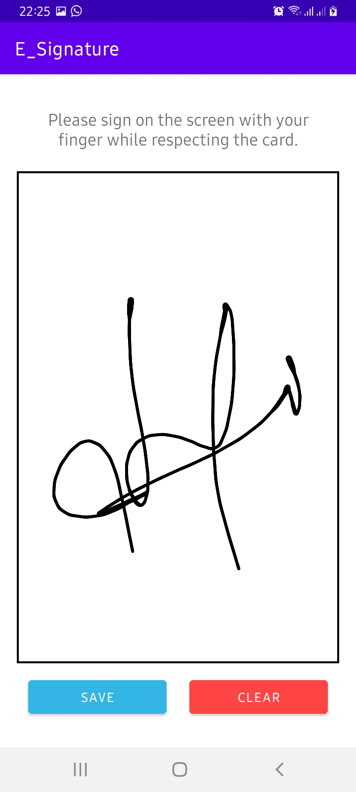

# e-signature FOR android

## Project Overview
Here you will get a simple demo for how to use SignaturePad library for android application.
You may have seen many eCommerce companies like Amazon provides a facility for digital signature. You can implement that feature in your app easily by using a library called Signature Pad.

## Screenshots

